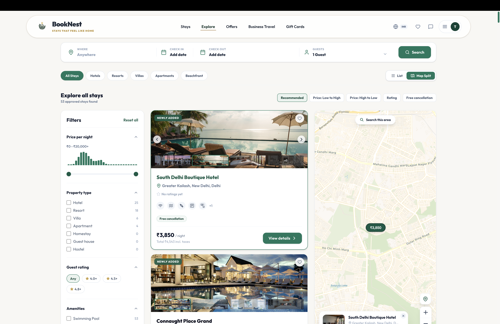
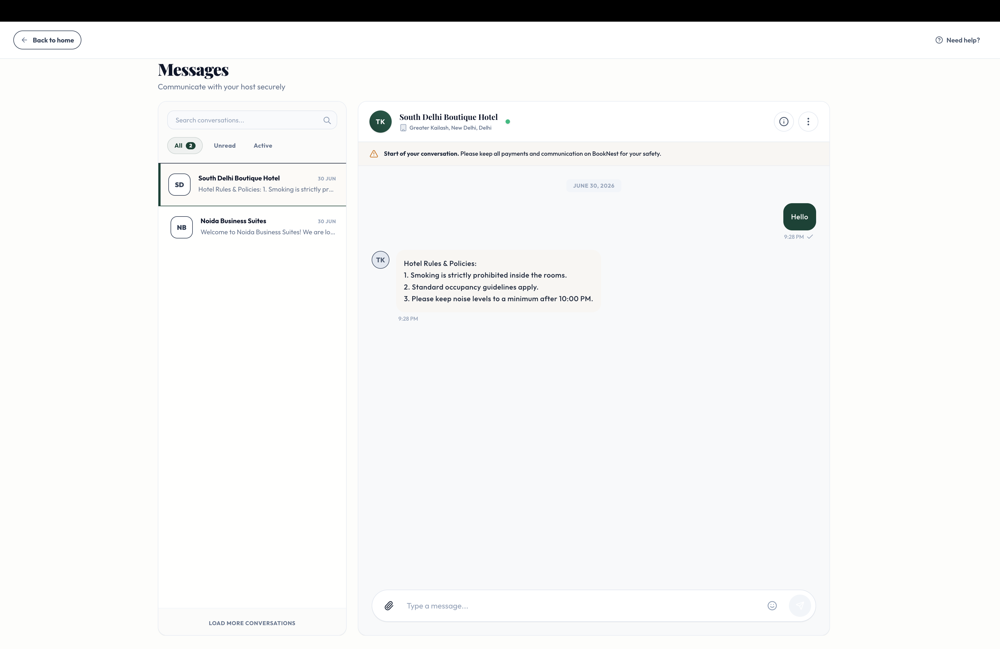

<div align="center">


# BookNest

### Hotel Management and Booking — Simplified

A modern platform where hotel managers list and manage their properties and guests discover, book, and communicate with hosts — all in one place.

<br/>

[](https://hms-and-booking.vercel.app)
[](https://nextjs.org)
[](https://supabase.com)

</div>

---

## What is BookNest?

BookNest is a full-stack hotel booking platform built for two kinds of people:

- **Guests** who want to browse and book hotels quickly, pay online, and communicate directly with the host.
- **Hotel managers** who want a clean, professional way to list their property, manage bookings, handle check-ins, and talk to their guests.

Think of it as a self-contained, independently deployable alternative to the large booking platforms — built from scratch.

---

## Who is it for?

| User Type | What they can do |
|-----------|-----------------|
| Guest | Search hotels, book rooms, pay online, check in with a QR code, message the host |
| Manager | List hotels, manage rooms and availability, view earnings, chat with guests |
| Staff | Assist managers with check-ins and guest communication |
| Admin | Approve hotel listings, verify managers, oversee the platform |

---

## Key Features

### Search and Discovery

Guests can search hotels by destination, travel dates, and number of guests. Results are shown as hotel cards with pricing, location, and photos. A full interactive map view lets guests explore hotels geographically — each hotel appears as a clickable pin on the map.

---

### Hotel Listing Pages

Each hotel has a dedicated page with:

- A full photo gallery
- Room types with individual pricing and capacity
- An interactive location map
- Guest reviews and ratings
- A complete amenities list

---

### Booking Flow

The booking experience is smooth and guided:

1. Select check-in and check-out dates from a live availability calendar
2. Choose a room type
3. Review a transparent price breakdown (room rate, nights, taxes)
4. Complete payment securely via Razorpay
5. Receive an instant booking confirmation email

---

### Online Payments via Razorpay

Payments are handled through **Razorpay**, a trusted payment gateway. The integration supports credit cards, debit cards, UPI, and net banking.

All payment processing happens on Razorpay's secure servers — card details never touch BookNest's systems. A server-side verification step ensures payments cannot be tampered with.

---

### QR Code Check-In

Every confirmed booking generates a unique **QR code**. Guests present it at the hotel. Staff scan it from the management dashboard using their device camera to instantly verify and record the check-in.

No paper. No manual lookups. No delays.

---

### Real-Time Messaging

Guests and hotel managers can send messages directly within the platform. Messages are delivered instantly — no page refresh required. The system also supports:

- File and image attachments (with automatic compression before upload)
- Typing indicators
- Unread message badges in the navigation bar
- Direct contact shortcuts to call, WhatsApp, or email the host

---

### Hotel Manager Portal

Managers have a dedicated section of the platform where they can:

- Create hotel listings through a guided, step-by-step form
- Manage rooms, pricing, and availability
- View and respond to guest messages
- Track bookings and check-in status
- Monitor earnings and request payouts
- Invite staff members to assist with their property

---

### Admin Dashboard

Platform administrators have visibility into everything:

- All users across the platform
- Hotel listing approvals and rejections
- Manager verification requests
- Platform-wide booking and revenue statistics

---

## Screenshots

**Homepage** — Hero search, featured stays, and destination highlights


---

**Explore Hotels** — Full hotel grid with filters, price range, property type, and a live map split view



---

**Manager Portal** — Add and manage all your hotel properties, view occupancy at a glance


---

**Real-Time Messaging** — Guest inbox with instant delivery, conversation list, and message history



---

The full platform is live at **[hms-and-booking.vercel.app](https://hms-and-booking.vercel.app)**

---

## Built With

| Layer | Technology |
|-------|-----------|
| Framework | Next.js 16 (App Router) |
| Database | Supabase (PostgreSQL) |
| Authentication | Supabase Auth and Google OAuth |
| Payments | Razorpay |
| Maps | MapLibre GL and Leaflet |
| Real-Time Messaging | Supabase Realtime (WebSockets) |
| Email | Brevo (transactional email API) |
| Hosting | Vercel |
| Styling | Tailwind CSS |

---

## Security

- All database tables are protected with Row Level Security. Users can only access data they are permitted to see.
- Payments are verified server-side using a cryptographic signature before any booking is confirmed.
- Admin and manager routes are protected by role checks on every API request.
- User email addresses are stored in a private authentication schema and are never exposed to the client directly.

---

## Running Locally

**Prerequisites:** Node.js 18+, a Supabase project, a Razorpay test account, a Brevo account.

```bash
# Clone the repository
git clone https://github.com/ITZ-SH1NZ/HMS-and-booking.git
cd HMS-and-booking

# Install dependencies
npm install

# Configure environment variables
# Copy .env.local and fill in your credentials
npm run dev
```

Open [http://localhost:3000](http://localhost:3000) in your browser.

---

## Project Structure

```
app/
  hotels/       Hotel listing and detail pages
  bookings/     Booking management, check-in, and reviews
  messages/     Guest inbox and real-time messaging
  dashboard/    Guest bookings dashboard
  manager/      Hotel manager portal
  admin/        Admin dashboard
  api/          All server-side API routes

components/     Shared UI components
lib/            Utilities, email templates, database helpers
supabase/       Database schema and migration files
```

---

<div align="center">

Built by **Team Neuron**

[Live Platform](https://hms-and-booking.vercel.app) &nbsp;&middot;&nbsp; [GitHub Repository](https://github.com/ITZ-SH1NZ/HMS-and-booking)

</div>
